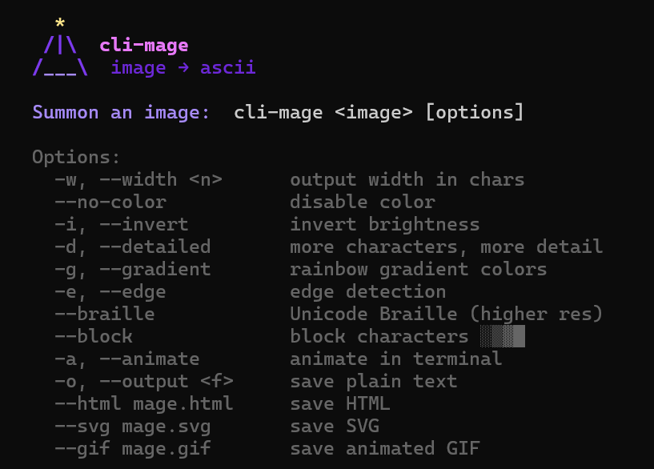

# cli-mage ✦

A magical CLI tool that converts images to ASCII art in your terminal.

```
npm install -g github:yerettegroup/cli-mage
```

---

## Usage

```
cli-mage <image> [options]
```

```
cli-mage photo.png
cli-mage photo.png --gradient
cli-mage photo.png --braille -w 200
cli-mage photo.png --save mage.gif
cli-mage photo.png --save mage.png
cli-mage photo.png --save mage.html
cli-mage animation.gif
cli-mage qr "https://yerettegroup.com"
curl https://example.com/image.png | cli-mage
```

---

## Options

| Flag | Description |
|---|---|
| `-w, --width <n>` | Output width in characters (default: 100) |
| `--no-color` | Disable color output |
| `-i, --invert` | Invert brightness |
| `-d, --detailed` | Use a larger, more detailed character set |
| `-g, --gradient` | Rainbow gradient color (ignores source colors) |
| `-e, --edge` | Edge detection mode (Sobel filter) |
| `--braille` | Render using Unicode Braille characters (2× resolution) |
| `--block` | Render using block characters ░▒▓█ |
| `-a, --animate` | Animate in terminal — Ctrl+C to stop |
| `-o, --output <file>` | Save plain-text output to file |
| `--save <file>` | Save as `.html`, `.svg`, `.gif`, `.png`, or `.jpg` |

---

## QR Codes

```
cli-mage qr <text or URL> [options]
```

| Flag | Description |
|---|---|
| `--no-color` | Disable color output |
| `-o, --output <file>` | Save plain-text output to file |
| `--save <file>` | Save as `.html`, `.svg`, `.png`, or `.jpg` |

Works fully offline — no internet required.

---

## Requirements

- Node.js 18 or later

---

## License

cli-mage is licensed under the GNU Affero General Public License v3.0 (AGPL-3.0).

Contact: hello@yerettegroup.com

---

*A [Yerette Group](https://github.com/yerettegroup) project.*
